[nav](../docs/nav.md)

## Application Description

Event Planner is a cloud-based application that helps you keep track of various events. With the help of this app, you can sign up for events and later find the events that you have signed up for. You can also create your own events and use the application as an event calendar.

The application initializes a login screen where the user has the choice of either logging in with an existing user or to register a new user. While registering for the first time the user is asked to enter an email, a password and a birthdate, with this data a new user is created, as long as no user with the corresponding email exists. A user who already has an existing user can enter their email and password in order to log in. See screenshot of register page (Figure 2) and log in page (Figure 1). 

 

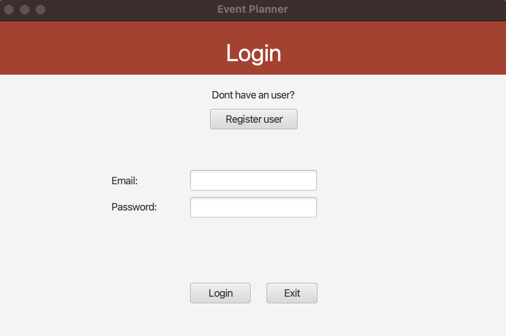
Figure 1: The view allowing the user to log in to an existing user.

 

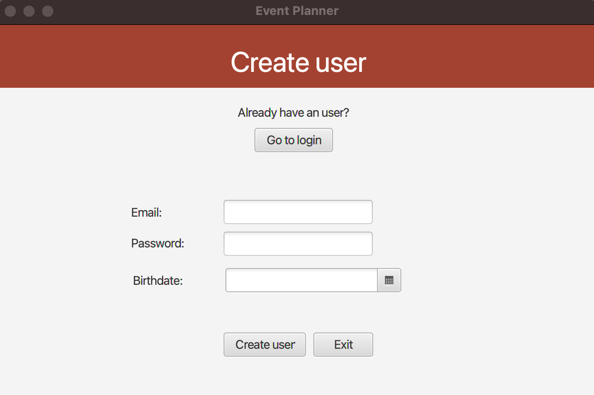
Figure 2: The view for registering new users.

 

The user then enters the main event page where various events are displayed. The user can browse through these and select an event they want to sign up for / save to their events. This can be achieved by selecting the event and clicking the button "Add event". The user can add as many events as they want, however, an event cannot be added to My Events multiple times. It is also possible to register through each event's information page. Users can search for events and filter all events from events that the user has registered to their own events. See screenshot of events page (Figure 3), user filtering by registered events (Figure 4) and event filtering by search (Figure 5).

 

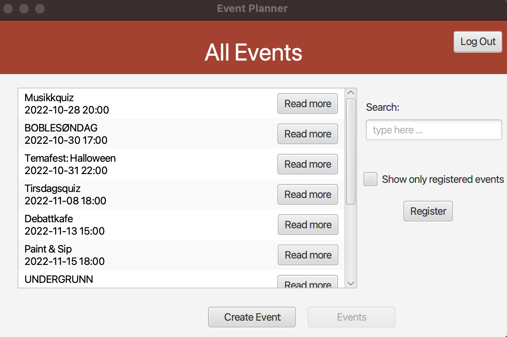
Figure 3: Page displaying all available events.

 

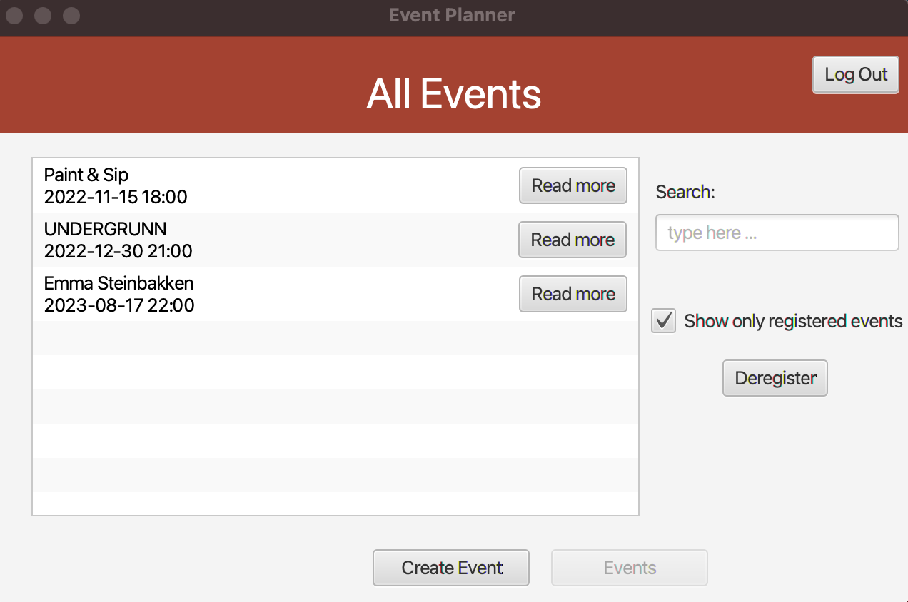
Figure 4: Page displaying all events the user is registered to.

 

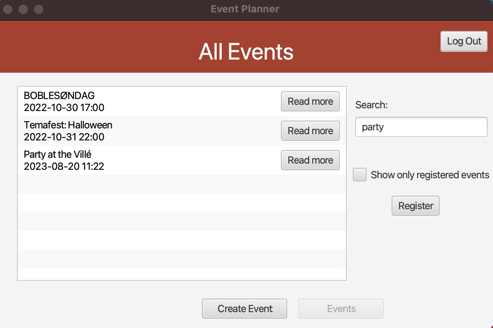
Figure 5: Page displaying the filtering possibility using the search bar.

 

Additionally, every event has their own info page with a short event description and additional information about time, location, author or creator of the event and how many registered users there are for this particular event. The user has the possibility to register for an event through this page or return to the main page. Additionally, a user that has created an event can delete their own events. However, it is not possible for users to delete events that the user has not created. See screenshot of the info page for default event (Figure 6) and for an event that the user has created (Figure 7), last screenshot is of a confirmation popup window the user will see if he or she wants to delete an event (Figure 8).

 

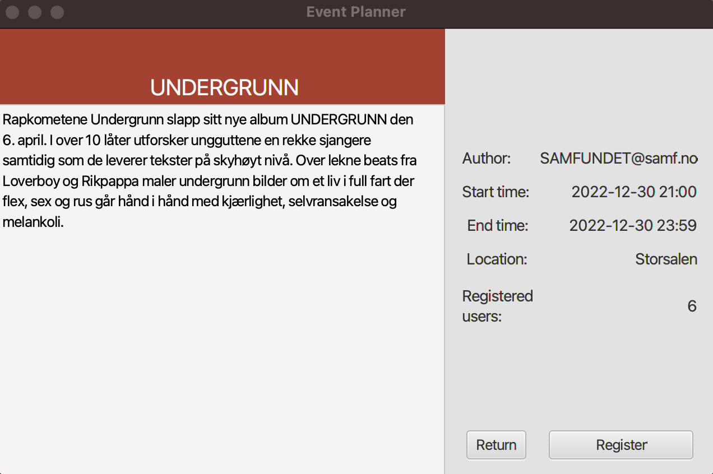
Figure 6: Event information page.

 

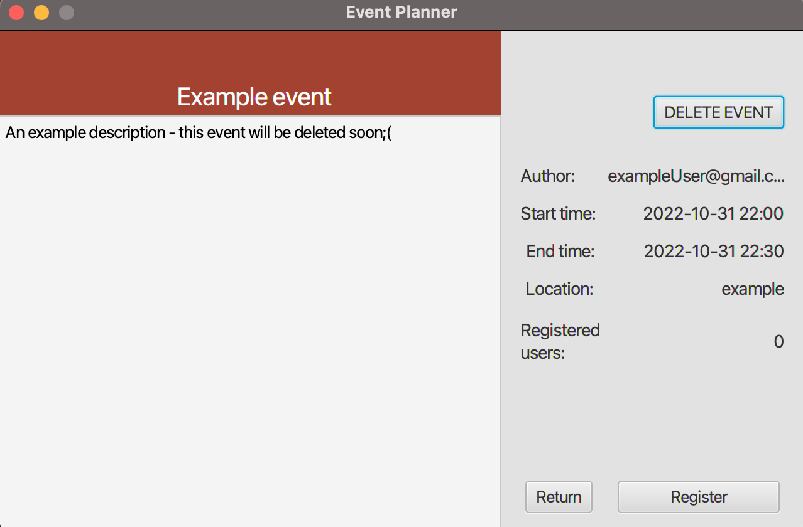
Figure 7: Event information page where the user is the author of the event.

 

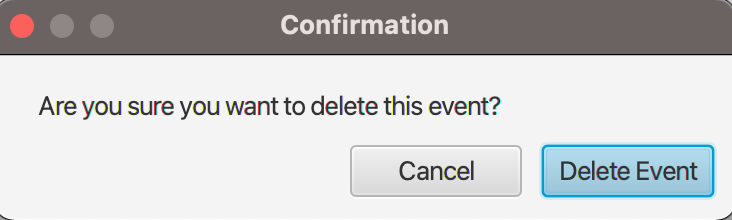
Figure 8: The confirmation dialog appearing on deletion of event.

 

Finally, users can create their own events! This is done by navigating to the Create Event-page in the bottom menu. The user then sees a screen with a couple of text fields for input information for the new event such as name of event, time duration, location, description of the event and an event type. After filling out the information that is required and clicking the "Create Event"-button, a new event will be created and added to the main Event page. See screenshot of create event page when creating a new event (Figure 9) and the event on the main page (Figure 10).

 

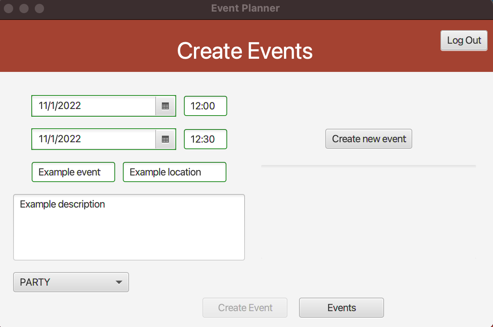
Figure 9: The view for creating a new event

 

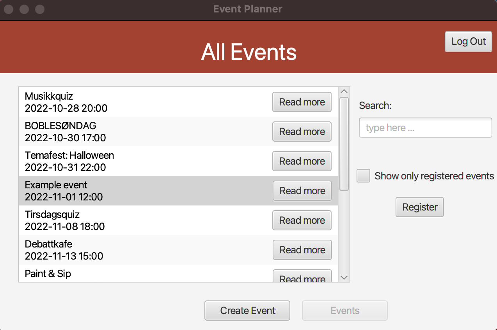
Figure 10: The new event added to the main event page.

 

## Sequence Diagram

This sequence diagram illustrates the flow of logic in the application throught time. Here you can see how the REST API layer interacts with our model base.

A user starts by registering a new account and registers for an event. Then the user creates a new event and proceedes to delete the event that was created. 

We have used *alt* boxes to represent an alternative flow of logic. Descriptive notes can be found in the diagram that explain parts of the diagram that can be unclear.

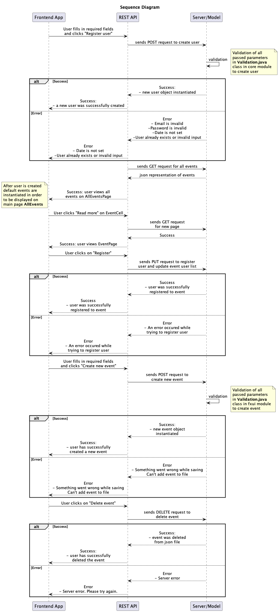

 

## User story 1

As an engaged student in Trondheim, Ole would like to have an overview of what events take place at *Studentersamfundet*. He wants a solution where he can find events that *Samfundet* offers and filter the events that he is interested in attending from the rest. He would also like to have the opportunity to add his own events for his extra curricular activity group.

Important to be able to see:
- While browsing: which events exist/are set up by the *Studentersamfundet*, where and when these events will be
- When you have liked an event: being able to see events that you have liked on a separate 'My events' page
- When you have created a new event: being able to see the event on the main event page 

Important to be able to do:
- Add an event to the My Events page by clicking on the desired event and pressing the button "add to my events"
- Create your own events 
- Navigating between pages using the menu bar.

## User story 2

Kari is a student at NTNU and likes to attend theme parties at *Studentersamfundet*. She would like to easily find what events are happening at the *Samfundet* and read about them to see if any events sound exiting. Kari would like a solution where she can find, filter, create and read about different events. She also likes to organize parties for her friend group and would like to use this solution for creating and deleting her own events.

Important to be able to see:
- While browsing: which events exist/are set up by the *Studentersamfundet*, where and when these events will take place, read a description about every event and be able to see how many other participants have signed up for/liked the event
- When user has liked an event: be able to filter away all the other events and only see liked events on same page
- When user has created a new event: being able to see the event on the main event page, being able to see the description, the author, start and end time on that event's description page 
- When a user has deleted an event: not seing that event on the all event page 

Important to be able to do:
- Add an event to the My Events page by clicking on the desired event and clicking the button "add to my events", or by going to event's description page and clicking the "register" button 
- Create your own events - choose name, date, location, type of event and write a description of the event
- An author of an event can delete their own events but not events that they are not the author to
- Navigating between pages using the menu bar, navigate to event's description pages and back to all events page, filter favorite events

