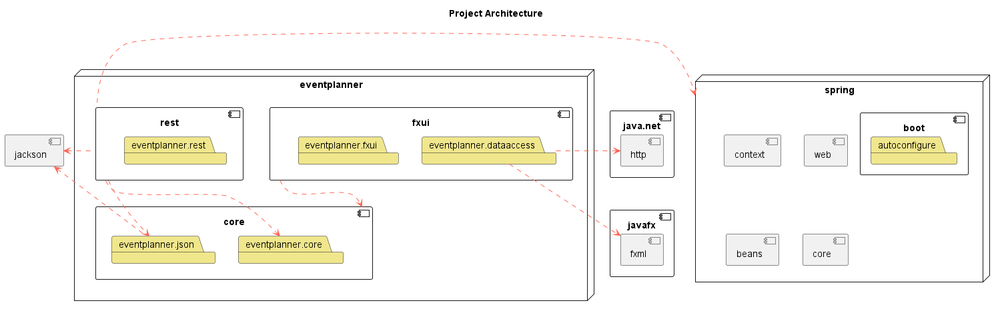

[nav](../../docs/nav.md)

# Group 25 - Core module

## Module content

Core module contains core layer and persistence layer.

- The persistence layer can be found at [/src/main/java/eventplanner/json](./src/main/java/eventplanner/json/)
- The core layer can be found at [/src/main/java/eventplanner/core](./src/main/java/eventplanner/core/)

### Persistence layer

The persistence layer can be found [here](./src/main/java/eventplanner/json/).

This is where data about users and events are stored. Events will be stored in a json file. Each event will be stored as its own object with properties; type, name, start-time, end-time, location and users. 
    
    {
        "type" : "Example",
        "name" : "Examplename",
        "start-time" : "2003-08-17T19:09",
        "end-time" : "2003-08-18T14:09",
        "location" : "Examplelocation"
        "users" : 
            [
                "ExampleName1",
                "ExampleName2"
            ]
    }

The names saved in "users" will refer to the attendants at the event. The way our application is set ut, there is no need to store information about the user, as the user will be asked to input his/her name at app-launch. We do this because there is no need for security as all events are "open to the public".


### Core layer

The core layer can be found [here](./src/main/java/eventplanner/core/).

This layer contains classes that represent the core logic of the project. The Event class can be used to initiate an object with the properties described above in the persistence layer. It also contains an list of all the users connected to the event.

The user-class can be used to initiate an user object. This object will have the property name.

## Module Architecture


**Legend:**
 - A red, dotted line from *A* to *B* depicts that *B* is a dependency of *A*.
    - Arrows from a module indicate that all layers in the module has the dependency
 - The "box" named *eventplanner* represents the collection of local modules.
 - The components with a symbol in the top-right corner represents modules, such as *javafx* and *core*.
 - The folders represent the current packages or layers of the modules.

## Reports

Jacoco code-coverage:

 ```
mvn test
```
Spotbugs and checkstyle:

 ```
mvn site
```

All reports can be found at each respectable modules `target/site` folder.

jacoco.html;
spotbugs.html;
checksstyle.html;