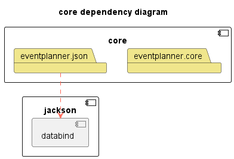
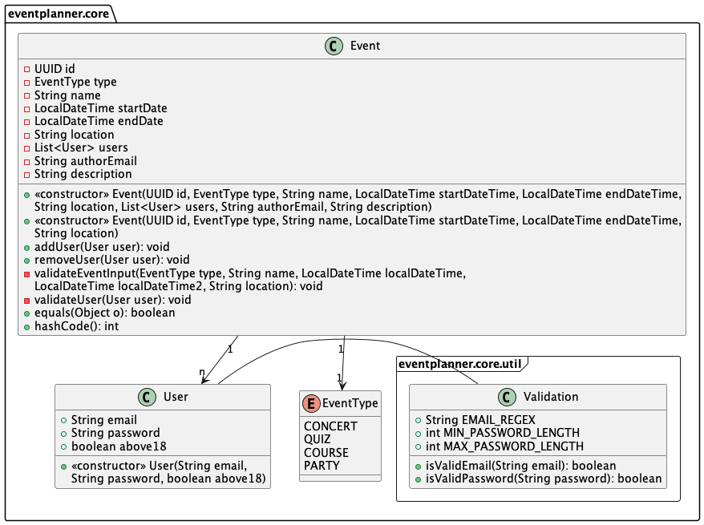
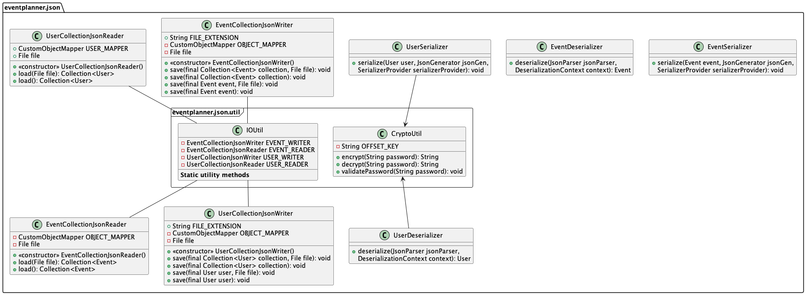

[nav](../../docs/nav.md)

# Core module

## Module Content

The core module contains a core layer and a persistence layer.

- The persistence layer can be found at [/src/main/java/eventplanner/json](./src/main/java/eventplanner/json/)
- The core layer can be found at [/src/main/java/eventplanner/core](./src/main/java/eventplanner/core/)

We found it practical to create a common module for both the persistance and core logic. The reason being that the persistence layer has high coupling to the core layer. The core layer is not dependent of the persistence layer, however the logic in core is limited, and for a project of this size it's practical to keep the layers together.

<br>

### **Persistence layer**

The persistence layer can be found [here](./src/main/java/eventplanner/json/).

To improve the applications usability, we wish to limit the user’s explicit knowledge of the data persistence, thus we choose to not use the desktop metaphor. User data will be displayed upon the user entering a unique username. Where and how the data is saved will not be disclosed to the user. When a user clicks on the “create new event”-button, “add event”-button or “remove event”-button, the saving should be implicitly done by the program.

[This](../fxui/src/main/resources/eventplanner/fxui/data/event.json) is where data about users and events are stored. Events will be stored in a json file. Each event will be stored as its own object with the following properties: Id, type, name, start-time, end-time, location, author, description and users. 

```json
{
    "id" : "123e4567-e89b-12d3-a456-356642440000",
    "type" : "EXAMPLE TYPE",
    "name" : "EXAMPLE NAME",
    "start-time" : "2003-08-17T19:09",
    "end-time" : "2003-08-18T14:09",
    "location" : "EXAMPLE LOCATION",
    "author" : "author@example.com",
    "description" : "EXAMPLE DESCRPIPTION", 
    "users" : [ "example@email.one", "example@email.two"]
}
```

The emails saved in "users" refer to the attendees at the event, where each user has a unique email address.

The users will be stored in its own json file (the filepath depends on whether local or remote data access is currently used, [read more](../rest/README.md)). The User object will be stored with properties: Email, password and above18. Where the password will be stored as its hashed version. The above18 property represents whether the user is above 18 years. The serialization of an example user is provided below:

```json
{
    "email" : "example@email.one",
    "password" : "encryptedpassword",
    "above18" : false
}
```
#### **Password encryption:**
The current implementation of password encryption is only meant to serve as an example. We chose to use a variation of the classic Vignère cipher to provide basic encryption of the users' passwords. The password is encrypted at the serialization phase, and later decrypted at the deserialization phase. 

The reasoning for choosing a relatively unsecure cipher is that proper implementation of password encryption using public and private keys is unecessary for a project of this scale. In addition we do not have the knowledge or experience to properly implement the security needed. If this project was meant to be used by a user base, we would be required to implement better security protocols.

<br>

### **Core layer**

The core layer can be found [here](./src/main/java/eventplanner/core/).

This layer contains classes that represent the core logic of the project. The Event class can be used to instantiate an object with the properties described above. It also contains an list of all the users connected to the event.

<br>

## Module Architecture


**Legend:**
 - A red, dotted line from *A* to *B* depicts that *B* is a dependency of *A*.
    - Arrows from a module indicate that all layers in the module has the dependency
 - The "box" named *eventplanner* represents the collection of local modules.
 - The components with a symbol in the top-right corner represents modules, such as *jackson* and *core*.
 - The folders represent the current packages or layers of the modules.

<br>

## Core module Class Diagram



**Legend:**
Here we have divided the core module into its two consisting folders for simplicity. 
We have divided the diagrams into two parts, one for each package. This is to promote readability and make them easier to understand.
 - Lines from *A* to *B* depicts an association between *A* and *B*. 
    - An arrow from *A* to *B* means that *A* has access to *B* but *B* does not have acces to *A*
    - A line between *A* and *B* represents a relationship between *A* and *B*
    - The multiplicity arrows represent 1-to-1, 1-to-n or n-to-n relations between classes 
 - The icons to the left of fields and methods represent visibility:
 
 - The "folder" named *eventplanner.core* is the core module, while the "frame" named *eventplanner.core.util* represent a folder in the core module.

<br>

## Reports

The JaCoCo code coverage report will be generated on

 ```
mvn test
```
and Spotbugs and Checkstyle reports are generated on the command

 ```
mvn site
```

All reports can be found at the module's `target/site` folder. The SpotBugs report and Checkstyle report is found at site, while the JaCoCo report can be found at `target/site/jacoco`. By opening the file named `index.html` in your browser you can display the coverage report.