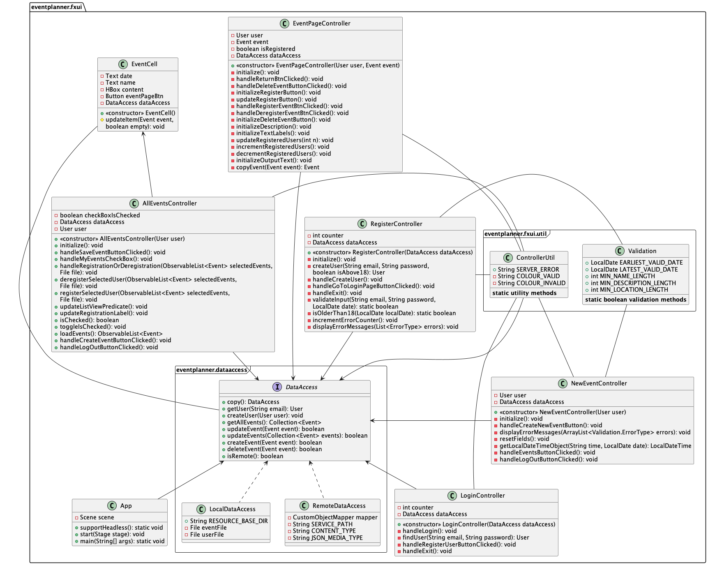
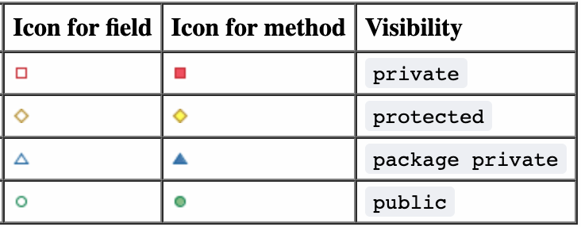

[nav](../../docs/nav.md)

# FXUI module

## Module Content

- [Controllers, App and EventCell](./src/main/java/eventplanner/fxui/)
- [Data access classes](./src/main/java/eventplanner/dataaccess/)
- [FXML files and CSS stylesheet](./src/main/resources/eventplanner/dataaccess/)

<br>

### **FXML files**


The FXML files can be found [here](/eventplanner/fxui/src/main/resources/eventplanner/fxui/).

There are five FXML files, one for each view. The FXML files are used to design the structure of the user interface. We chose to use a CSS stylesheet for styling the user interface, to better the separation of the model, view and controllers. The stylesheet can be found [here](/eventplanner/fxui/src/main/resources/eventplanner/fxui/EventPlanner.css)

<br>

### **Controllers, App and EventCell**

The controllers, main class and EventCell class can be found [here](/eventplanner/fxui/src/main/java/eventplanner/fxui/).

There is one controller for each view. This allows us to split the responsibility for the different views, thus allowing us to have high cohesion. If we were to have one controller for all views, it would have responsibility for an abundance of JavaFX controls and fields, and would quickly become unmanageable. Only a few of the methods and controller fields would be connected, and so the cohesion would be low.

The controllers rely on a utility method in the utility class [ControllerUtils](./src/main/java/eventplanner/fxui/util/ControllerUtil.java) to inject the necessary fields into the succeeding controller when switching between views. We use a Controller Factory to inject the fields upon starting a new scene (view) with a FXMLLoader. 

The [App.java](./src/main/java/eventplanner/fxui/App.java) class the applications main class, and runs on the command 

    mvn java:fx
when in the directory `eventplanner/fxui/`.


The class [EventCell.java](./src/main/java/eventplanner/fxui/EventCell.java) is used to customize the default cells of an listview. This allows us to display several fields from a Event object. We chose to display the name, starting time and a button sending the user to an Event information page.

<br>

### **Data access**

The application needs functionality for creating, retrieving, updating and deleting data. The [DataAccess interface](./src/main/java/eventplanner/dataaccess/DataAccess.java) represents data handling for the application, and serves as an interface between the persistence mechanism and the client.

The dataaccess classes are separated from the controller classes. This creates a more organized module, and separates the fxui classes from json interactions. The dataaccess layer works as a bridge between data handling and the fxui.

There are implemented two ways for accessing and altering data, a [remote data access](#remote-data-access) point and a [local data access](#local-data-access) point.

#### **Remote data access**
At startup, the application will try to connect to the server via the static method;

    RemoteDataAccess.connection()

The static method attempts to send a dummy request to the server, and an exception is thrown if the request fails. If the connection did not throw an exception, indicating that the server is functional, the application will be use  the [remote data access](./src/main/java/eventplanner/dataaccess/RemoteDataAccess.java) point.

In practice, this means that data can be accessed and altered by sending API requests to the local server.


#### **Local data access**

However, if the connection can not be established. The application will use the [LocalDataAccess class](./src/main/java/eventplanner/dataaccess/LocalDataAccess.java) to access and alter data.

#### **Distinction**
The distinction between local and remote data access might seem irrelevant considering the data is stored locally either way. But this functionality would be crucial if the server was hosted remote.

This feature also gives the user possibility for running the application offline. However, the data files are not the same as when remote data access is used.

<br>

## Module Architecture


**Legend:**
 - A red, dotted line from *A* to *B* depicts that *B* is a dependency of *A*.
    - Arrows from a module indicate that all layers in the module has the dependency
 - The "box" named *eventplanner* represents the collection of local modules.
 - The components with a symbol in the top-right corner represents modules, such as *javafx* and *core*.
 - The folders represent the current packages or layers of the modules.

<br>

## FXUI module Class Diagram


**Legend:**
 - Lines from *A* to *B* depicts an association between *A* and *B*. 
    - An arrow from *A* to *B* means that *A* has access to *B* but *B* does not have acces to *A*
    - A line between *A* and *B* represents a relationship between *A* and *B*
    - A dotted arrow from *A* to *B* means that *A* implements methods or other logic from *B*
 - The icons to the left of fields and methods represent visibility:
 
 - The "folder" named *eventplanner.fxui* is the fxui module, while the "frames" named *eventplanner.dataaccess* and *eventplanner.fxui.util* represent folders in the fxui module.

<br>

## Reports

A JaCoCo code coverage report is generated upon running the command

 ```
mvn test
```
and Spotbugs and checkstyle reports for identifying potential issues is generated on running the command

 ```
mvn site
```

All reports can be found at the module's `target/site` folder. The SpotBugs report and Checkstyle report is found at site, while the JaCoCo report can be found at `target/site/jacoco`. By opening the file named `index.html` in your browser you can display the coverage report.