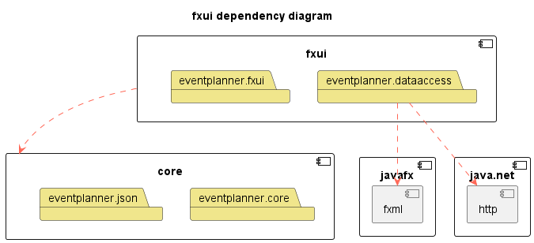

[nav](../../docs/nav.md)

# Group 25 - FXUI module

## FXUI module content

- [FXML-files](./src/main/resources/eventplanner/fxui/)
- [Controllers, App and EventCell](./src/main/java/eventplanner/fxui/)
- [Data access](./src/main/java/eventplanner/fxui/)

### FXML files


The fxml files can be found [here](/eventplanner/fxui/src/main/resources/eventplanner/fxui/).

There are three fxml files. One for each application-tab; all-events, my-events, create-event.

### Controllers, App and EventCell


The controllers, App and EventCell can be found [here](/eventplanner/fxui/src/main/java/eventplanner/fxui/).

There is one controller for each application-tab (as described previously). These classes handle switching from one view to another, and functionality within the application (for example; button-funcionality).

The [App.java-class](./src/main/java/eventplanner/fxui/App.java) is responsible for launching the app when the maven launch command is ran: 

    mvn java:fx

The class; [EventCell.java](./src/main/java/eventplanner/fxui/EventCell.java) is used to display events in the ui.

### Data access

The application need functionality for altering and gathering data. The [DataAccess-interface](./src/main/java/eventplanner/fxui/DataAccess.java) represents data handling for the application.

There have been implemented two ways of accessing and altering data;

[Remote data access](#remote-data-access) & [Local data access](#local-data-access)

#### Remote data access
At startup, the application will try to connect to the server via the static method;

    RemoteDataAccess.connection()

If the connection did not throw an exception, the application will be ran with [remote data access class](./src/main/java/eventplanner/fxui/RemoteDataAccess.java).

This means that data can be accessed and altered by sending api-requests to the server.


#### Local data access

However, if the connection can not be established. The application will use the [Local-data-access class](./src/main/java/eventplanner/fxui/LocalDataAccess.java) to access and alter data.

#### Distinction
The distinction between local and remote data access might seem irrelevant considering the data will located localy either way. But this functionality would be crucial if the server was hosted remote.

This feature also gives the user possibility for running the application offline. However, the data-files are not the same as when remote data-access is used.

## FXUI module Architecture


**Legend:**
 - A red, dotted line from *A* to *B* depicts that *B* is a dependency of *A*.
    - Arrows from a module indicate that all layers in the module has the dependency
 - The "box" named *eventplanner* represents the collection of local modules.
 - The components with a symbol in the top-right corner represents modules, such as *javafx* and *core*.
 - The folders represent the current packages or layers of the modules.


## Reports

Jacoco code-coverage:

 ```
mvn test
```
Spotbugs and checkstyle:

 ```
mvn site
```

All reports can be found at each respective modules `target/site` folder.

jacoco.html;
spotbugs.html;
checksstyle.html;