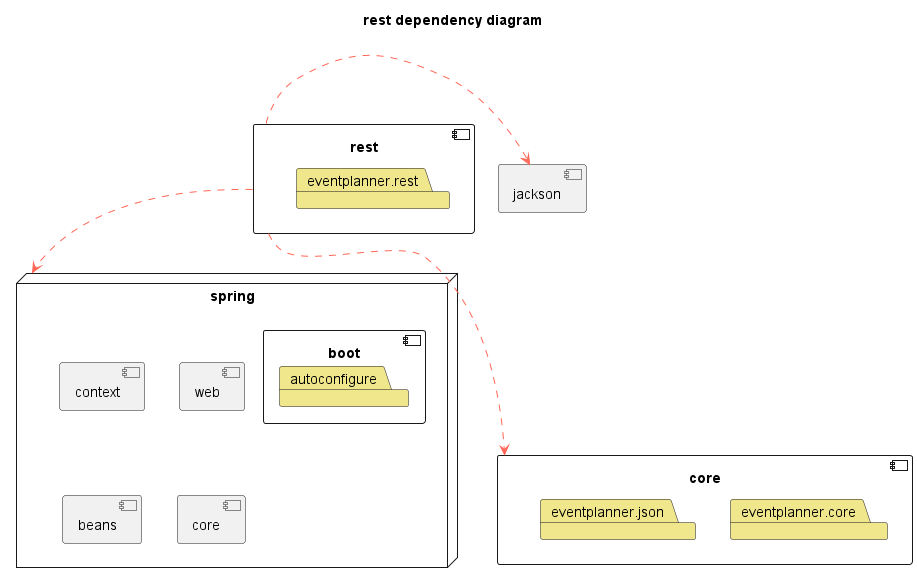

[nav](../../docs/nav.md)

# Group 25 - REST module

## Rest module content

- [ServerApplication](./src/main/java/eventplanner/rest/RestServiceApplication.java)
- [Controllers](./src/main/java/eventplanner/rest/)

### Serverapplication

The serverapplication can be found [here](/eventplanner/rest/src/main/java/eventplanner/rest/RestServiceApplication.java).

This class launches the server locally on path localhost, port 8080.

The server needs to run in order for the fxui-application to connect with remote-data-access. If server is not running, the fxui-application will run with local-data-access.

Starting the server:
 ```
java RestServiceApplication.java
```

There should be noted that all api-requests are ran locally even though there is beeing used an rest-server. This is the consequence of running the server on localhost. Ideealy the server would be hosted on a remote server, where it could be accesed by anyone with an internet connection. 

In this project, a local api-rest server is sufficient to prove that this application also would work with an remote hosted api-rest server. 

### Controllers, User and Event

The controllers can be found [here](./src/main/java/eventplanner/rest/).

A rest-api can be accesed by sending http-request to the server. For example;
 ```
http//:localhost:8080
```
The server will then get this request, and send back information depending on the controllers. Every request has a path, and every request with path starting with;
 ```
http//:localhost:8080/user
```
Will be sent to the corresponding controller. In this case, the usercontroller.

#### Eventcontroller
The Eventcontroller class can be found [here](./src/main/java/eventplanner/rest/EventController.java).

This controller handles all requests starting with;
 ```
http//:localhost:8080/event
```
This class implements methodes for:
- Getting all events
- Creating events
- Updating events
- Deleting events

#### Usercontroller
The Usercontroller class can be found [here](./src/main/java/eventplanner/rest/UserController.java).

This controller handles all requests starting with;
 ```
http//:localhost:8080/user
```
This class implements methodes for:
- Getting all users
- Getting single user
- Creating users

## Enchancement - API-key
As per now, the api-server is accesible by anyone. This is bad practice for api-servers.

Ideally we would add functionality for sending request with an api-key. The key would then be verified at the api-server. The response would depond on wether the given key is associated with access to the requested data.

We will not implement api-keys, but if the server were to run on an remote server, this is functionality we would implement.

## Rest module Architecture


**Legend:**
 - A red, dotted line from *A* to *B* depicts that *B* is a dependency of *A*.
    - Arrows from a module indicate that all layers in the module has the dependency
 - The "box" named *eventplanner* represents the collection of local modules.
 - The components with a symbol in the top-right corner represents modules, such as *javafx* and *core*.
 - The folders represent the current packages or layers of the modules.

## Reports

Spotbugs and checkstyle:

 ```
mvn site
```

All reports can be found at each respective modules `target/site` folder.

spotbugs.html;
checksstyle.html;