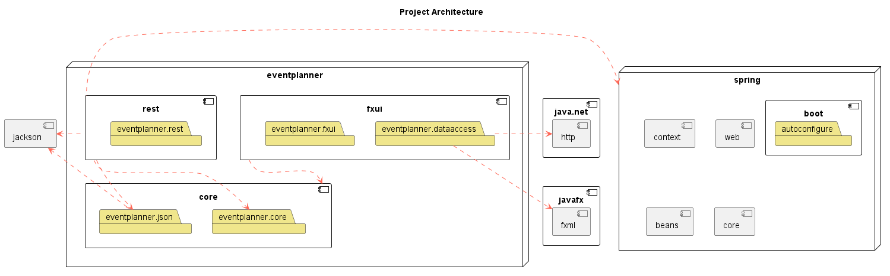

[](https://gitpod.stud.ntnu.no/#gitlab.stud.idi.ntnu.no/it1901/groups-2022/gr2225/gr2225) 

# Group 25 - EventPlanner

## Repository content
- The [**eventplanner**](eventplanner/) folder constitutes the local modules, as well as project documentation.
    - [eventplanner/core](eventplanner/core/) contains the core module, with a core logic layer and persistence layer using json.
        - The persistence layer can be found at [eventplanner/core/src/main/java/eventplanner/json](eventplanner/core/src/main/java/eventplanner/json/)
        - The core layer can be found at [eventplanner/core/src/main/java/eventplanner/core](eventplanner/core/src/main/java/eventplanner/core/)
    - [eventplanner/fxui](eventplanner/fxui/) contains the module for the user interface
    - Each of the modules have their respective test folders located at `eventplanner/[MODULE_NAME]/src/test/java/eventplanner/`
    - The respective resource directories are located at `eventplanner/[MODULE_NAME]/src/main/resources/`
- Release documentation can be found at [docs/.](docs/)
- Project documentation can be found at [eventplanner/README.md](eventplanner/README.md)

## EventPlanner Architecture


**Legend:**
 - A red, dotted line from *A* to *B* depicts that *B* is a dependency of *A*.
    - Arrows from a module indicate that all layers in the module has the dependency
 - The "box" named *eventplanner* represents the collection of local modules.
 - The components with a symbol in the top-right corner represents modules, such as *javafx* and *core*.
 - The folders represent the current packages or layers of the modules.


## Building
 ```
cd eventplanner
mvn install
```

Running mavens install command will validate, compile, test, package and verify the code. After it is done it will install the package to the local repository. Make sure you are in the correct directory (`gr2225/eventplanner/`)

## Usage

 ```
cd eventplanner/fxui/
mvn javafx:run
```

To run the program: change directory to `eventplanner/fxui/` and run the application with `mvn javafx:run`.
